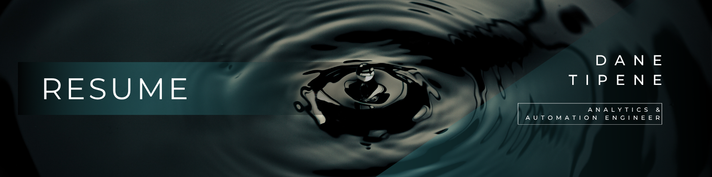
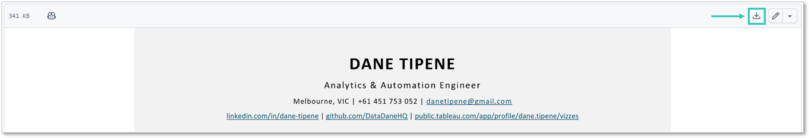

 

## Dane Tipene — Analytics & Automation Engineer

I walk into broken, expensive, manual processes and automate them out of existence.

**Selected deliverables:**

- Transcription pipeline processing ~3,500 enforcement call recordings — locally   hosted, privacy-preserving, speaker-labelled, zero manual intervention  
- Annual retailer reporting cycle — weeks of manual effort automated to a 10-minute rerun  
- 12-day regulatory validation workflow reduced to 3 days  
- Organisation's first locally-deployed, multi-model AI pipeline  

**Technical stack:** R · Python · SQL · Tableau · Azure · WhisperX · Shiny · SharePoint automation · AI pipelines

 

[Click here to view the PDF](01_Documents/Resume%20-%20Dane%20Tipene%202025-26.pdf)

To download, click the download button on the PDF preview page.

*Last updated: May 2026*
